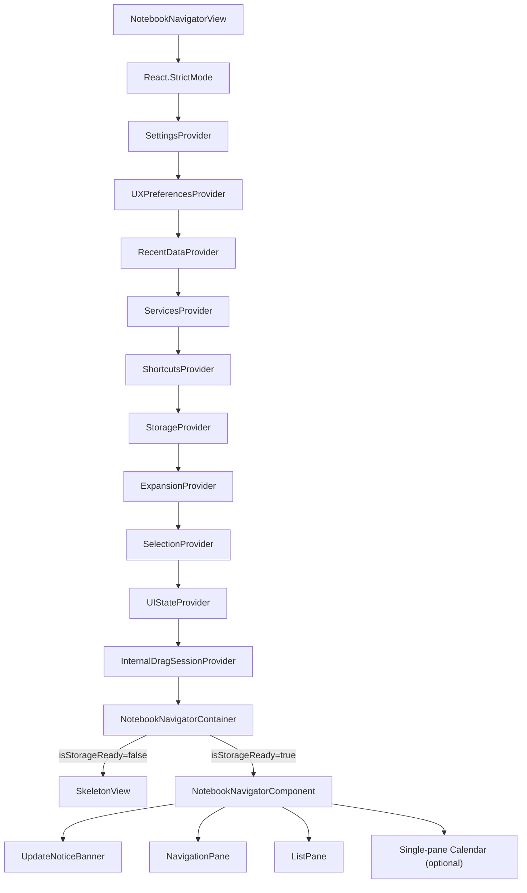
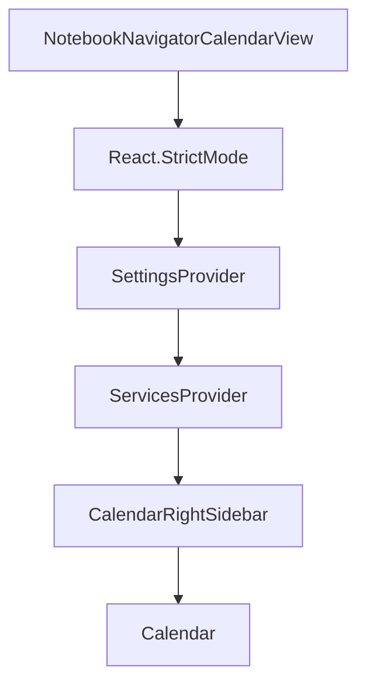
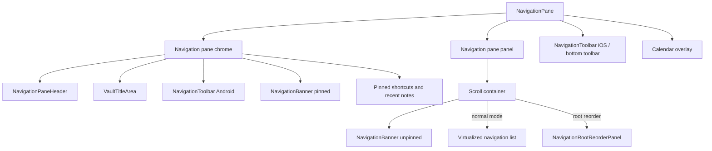
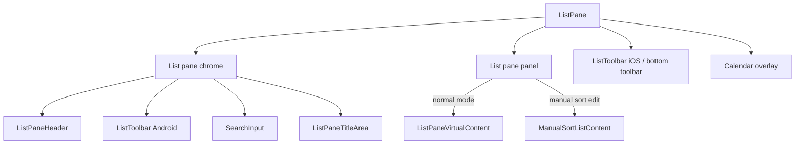
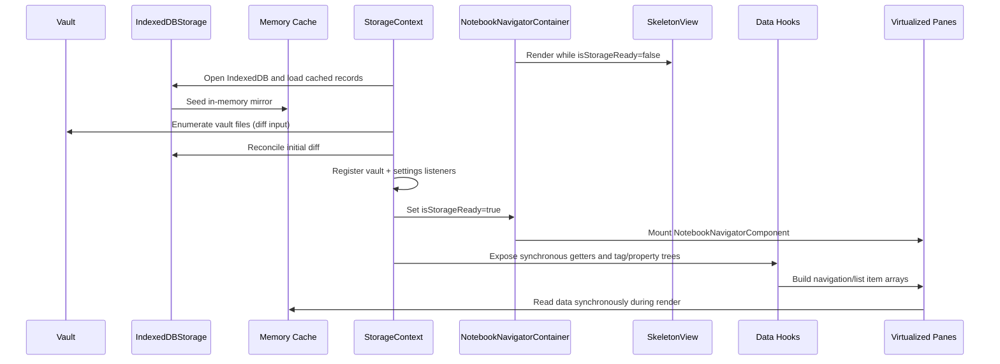
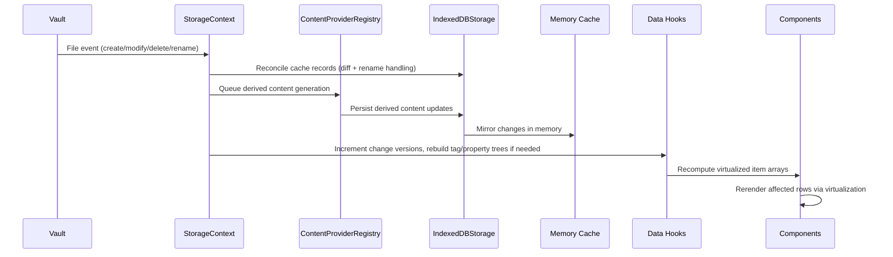
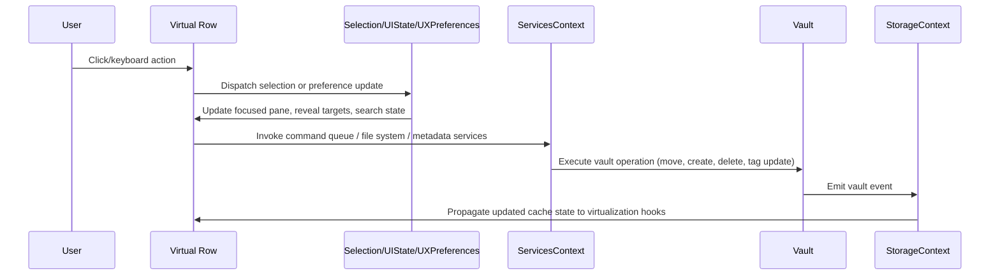

# Notebook Navigator Rendering Architecture

Updated: July 9, 2026

## Table of Contents

- [Overview](#overview)
- [Core Principles](#core-principles)
- [Component Hierarchy](#component-hierarchy)
- [Component Responsibilities](#component-responsibilities)
- [Virtualization Strategy](#virtualization-strategy)
- [Performance Optimizations](#performance-optimizations)
- [Data Flow](#data-flow)
- [Scroll Management System](#scroll-management-system)

## Overview

The Notebook Navigator plugin renders React applications inside two Obsidian `ItemView` implementations:
`NotebookNavigatorView` (main navigator) and `NotebookNavigatorCalendarView` (calendar right sidebar). Both trees are
mounted with `createRoot` and wrapped in `React.StrictMode`.

The main navigator UI renders `NavigationPane` and `ListPane` in dual-pane and single-pane layouts, and can also mount
an inline `Calendar` panel in single-pane mode when the left-sidebar calendar placement is configured below the panes.
During normal browsing and searching, both panes combine pane-level chrome with a virtualized scroll region for rows.
Both panes use `@tanstack/react-virtual` to mount only the rows required for the viewport plus overscan. The list pane
temporarily swaps the virtualized list for `ManualSortListContent` while manual-sort edit mode is active.

The calendar right-sidebar view renders `CalendarRightSidebar`, which hosts `Calendar` in sidebar mode and forwards
date-filter actions to the main navigator view.

Storage is provided through `StorageContext`, which coordinates `IndexedDBStorage`, an in-memory mirror, and the
`ContentProviderRegistry`. Components read cached preview data, metadata, and tag/property trees synchronously during render, and
row components that need live content updates subscribe to the storage instance (`IndexedDBStorage.onFileContentChange`).

Context providers isolate concerns such as settings, UX preferences, recent data, services, shortcuts, expansion state,
selection state, and pane layout. Derived data and behaviors live in dedicated hooks, leaving components to focus on
presentation and wiring.

`NotebookNavigatorComponent` also builds shared navigation source state and decoration models before rendering the panes.
That keeps folder/tag/property ordering, folder colours, navigation rainbow state, and file tag/property pill colours in
sync between `NavigationPane`, `ListPane`, manual-sort rows, and file rows.

## Core Principles

### 1. Virtualized Panes

`useNavigationPaneScroll` and `useListPaneScroll` wrap `useVirtualizer` from `@tanstack/react-virtual`. These hooks own
the scroll container refs, gate scroll execution on physical container visibility, keep version counters for list
rebuilds, and queue scroll intents (reveal requests, navigation jumps, configuration changes) so they run only after the
corresponding virtual items exist.

Both virtualizers use `scrollMargin`, and the list pane also uses `scrollPaddingStart`. The navigation pane uses
`scrollPaddingEnd` when bottom overlays need extra space. The list pane uses `scrollPaddingEnd` for the iOS floating
toolbar only; calendar overlay changes are handled by a follow-up scroll after the layout updates.

### 2. Synchronous Storage Mirror

`StorageContext` (`src/context/StorageContext.tsx`) coordinates `IndexedDBStorage`, the `ContentProviderRegistry`, and
the memory mirror. Components call helpers such as `getFile`, `getFiles`, `getTagTree`, `getFileDisplayName`,
`getFileCreatedTime`/`getFileModifiedTime`, `hasPreview`, and `findTagInTree` directly during render.

Components that need push-based updates (for example `FileItem`) subscribe to the `IndexedDBStorage` instance returned by
`getDB` and update local state when cached content changes.

### 3. Derived Data Hooks

Expensive data shaping lives outside component bodies. Examples:

- `useNavigationPaneData` builds the combined folder/tag/property/shortcut tree, computes note counts, resolves icons and
  colours, and tracks virtual folders, banners, pinned shortcuts, and section ordering.
- `useFolderDecorationState`, `useNavigationPaneSourceState`, `useNavigationPaneTreeSections`, and
  `useFileItemPillDecorationState` assemble the shared folder/tag/property source trees, root ordering, visibility
  filters, and rainbow/metadata decoration models consumed by both panes.
- `useNavigationRootReorder` exposes drag-and-drop reorder state and render helpers for root folders, tags, properties, and section
  headers.
- `useListPaneData` assembles list pane items (pinned files, spacers, group headers, search metadata, hidden item
  flags) and keeps lookup maps for virtualized scrolling and multi-selection.
- `useListPaneAppearance`, `useListPaneTitle`, `useListActions`, `useNavigationPaneKeyboard`, `useListPaneKeyboard`,
  `useNavigatorReveal`, and `useNavigatorEventHandlers` encapsulate behavior that would otherwise live inside
  components.

### 4. Context-Based State Layers

Ten providers wrap the primary navigator React tree:

- `SettingsContext` – persisted plugin settings and mutation helpers
- `UXPreferencesContext` – runtime-only preferences (search active, include descendant notes, show hidden items, pin
  shortcuts, calendar visibility)
- `RecentDataContext` – recent notes list and recent icon history sourced from local storage
- `ServicesContext` – Obsidian app handles plus file system operations, command queue, metadata service, tag operations,
  property operations, tag tree service, property tree service, Omnisearch integration, and release check service
- `ShortcutsContext` – pinned shortcut hydration, add/remove/reorder operations, and lookup maps
- `StorageContext` – IndexedDB mirror, tag/property trees, synchronous metadata accessors, cache rebuild entry points
- `ExpansionContext` – expanded folders, tags, properties, and virtual folders, plus collapsed list pane groups
- `SelectionContext` – selected folder/tag/property/file, multi-selection tracking, reveal targets, and selection dispatchers
- `UIStateContext` – pane mode (single vs dual), focused pane, current single-pane view, navigation pane width, pinned
  shortcuts toggle
- `InternalDragContext` – active internal drag payload (files, folder, tag, or property) read by the drag-and-drop hooks

`UIStateContext` handles pane transitions through `ACTIVATE_PANE`. Activating `navigation` or `files` updates both keyboard
focus and the current single-pane view to that content pane. Activating `search` assigns keyboard focus to the search input
and sets the current single-pane view to `files`, where search is rendered. Background search-filter updates, implicit
auto-reveal, and navigation calls with `skipFocus` do not dispatch pane activation.

The calendar right-sidebar tree uses `SettingsContext` and `ServicesContext` only.

### 5. Stable Rendering Contracts

Heavy components (`NavigationPane`, `ListPane`, `FolderItem`, `TagTreeItem`, `FileItem`, `ShortcutItem`,
`VirtualFolderComponent`) use `React.memo` with stable props. Event handlers are memoized with `useCallback`, derived
class names and counts use `useMemo`, and DOM measurements (navigation item height, indentation, scale transforms) are
applied via effects in `NotebookNavigatorComponent`, `useMeasuredElementHeight`, and `useNavigatorScale` so render output
stays pure.

Both panes use `useSurfaceColorVariables` to map semi-transparent theme variables to solid equivalents and expose surface
colors used for background compositing.

## Component Hierarchy

### Navigator view stack



### Calendar right-sidebar stack



### NavigationPane subtree



### ListPane subtree



## Component Responsibilities

### NotebookNavigatorView

**Location**: `src/view/NotebookNavigatorView.tsx`

- Creates the React root with `createRoot`, wraps it in `React.StrictMode`, applies mobile/platform classes, and mounts
  the provider stack
  (`Settings → UXPreferences → RecentData → Services → Shortcuts → Storage → Expansion → Selection → UIState → InternalDragSession`).
- Applies Android font compensation to the view container and propagates it to the rendered mobile root.
- Exposes imperative handlers to the plugin (cache rebuild, reveal actions, folder/tag/property modal navigation, search toggle,
  delete/move operations, shortcut creation).
- Dispatches `notebook-navigator-visible` on mobile when the drawer becomes visible so scroll hooks can resume pending
  reveal operations.
- Cleans up container classes and unmounts the React tree on view close.

### NotebookNavigatorCalendarView

**Location**: `src/view/NotebookNavigatorCalendarView.tsx`

- Creates a React root for the calendar right-sidebar leaf and mounts `SettingsProvider` + `ServicesProvider`.
- Renders `CalendarRightSidebar` as the calendar-only UI surface.
- Registers a settings listener to keep platform-specific container classes in sync.
- Unregisters listeners, unmounts the React tree, and tears down view container classes on close.

### CalendarRightSidebar

**Location**: `src/components/CalendarRightSidebar.tsx`

- Hosts the `Calendar` component configured for right-sidebar mode (`weeksToShowOverride={6}`, `isRightSidebar={true}`).
- Resolves the primary navigator leaf, opening it through `plugin.activateView()` when needed.
- Forwards calendar date-filter actions to `NotebookNavigatorView.addDateFilterToSearch(...)` and reveals the navigator leaf when applicable.

### NotebookNavigatorContainer

**Location**: `src/components/NotebookNavigatorContainer.tsx`

- Reads `isStorageReady` from `StorageContext` and pane mode from `UIStateContext`.
- Applies the scale wrapper returned by `useNavigatorScale` when rendering `SkeletonView` so loading layout matches the
  final scale.
- Restores the saved navigation pane size for the active orientation via `localStorage` helpers and
  `getNavigationPaneSizing`.
- Chooses between the skeleton layout and `NotebookNavigatorComponent`, ensuring layout parity (single vs dual pane,
  orientation, search state) while storage warms up.

### SkeletonView

**Location**: `src/components/SkeletonView.tsx`

- Mirrors the active layout with placeholder panes, respecting vertical vs horizontal splits and single-pane mode.
- Shows a search bar placeholder when search is enabled through `UXPreferences`.
- Uses the stored `paneSize` to match navigation pane width while storage loads.

### NotebookNavigatorComponent

**Location**: `src/components/NotebookNavigatorComponent.tsx`

- Wires selection, settings, services, shortcuts, UX preferences, and storage into pane components.
- Precomputes navigation source state, tree sections, folder decoration, and file pill decoration/order models so both
  panes render from the same sorted and filtered folder/tag/property model.
- Manages pane sizing and drag handles via `useResizablePane`, propagating resize props to `ListPane`.
- Shares a root container ref with both panes for keyboard handling and focus tracking.
- Runs `useDragAndDrop`, `useDragNavigationPaneActivation`, `useMobileSwipeNavigation`, `useNavigatorReveal`,
  `useNavigatorEventHandlers`, `useNavigationActions`, `useNavigatorScale`, and `useUpdateNotice` to provide navigation
  commands, drag activation, swipe gestures, and update notices.
- Bridges list search filters into `NavigationPane` for tag and property highlighting via `searchNavFilters`.
- Applies CSS custom properties for navigation item height, indentation, and font sizes once per settings change.
- Renders `UpdateNoticeBanner`, `NavigationPane`, `ListPane`, and the optional inline single-pane `Calendar` in the
  correct pane arrangement.

### UpdateNoticeBanner

**Location**: `src/components/UpdateNoticeBanner.tsx`

- Displays a temporary banner when `ReleaseCheckService` reports an available update.
- Uses `useAutoDismissFade` to manage banner visibility and fade-out timing.
- Opens Obsidian’s plugin manager via `obsidian://show-plugin?id=notebook-navigator` when clicked.

### NavigationPaneHeader

**Location**: `src/components/NavigationPaneHeader.tsx`

- Desktop header providing dual/single pane toggle, profile menu trigger, expand/collapse all, hidden item toggle, root
  reorder toggle, calendar toggle, and new folder action.
- Mobile variant renders a simplified profile menu trigger when multiple profiles exist.
- Defers tree-refresh callbacks with `requestAnimationFrame` so scroll hooks can remeasure after batch operations.

### VaultTitleArea

**Location**: `src/components/VaultTitleArea.tsx`

- Renders the active vault profile name in the navigation pane on desktop when multiple profiles exist.
- Uses `useVaultProfileMenu` to open the profile menu from a clickable trigger.

### NavigationToolbar

**Location**: `src/components/NavigationToolbar.tsx`

- Mobile toolbar providing expand/collapse, hidden item toggle, root reorder toggle, calendar toggle, and new folder
  action.
- Rendered at the top on Android. On iOS, floating toolbars render inside the pane; non-floating toolbars render in the
  bottom toolbar container.

### NavigationPane

**Location**: `src/components/navigationPane/NavigationPaneContent.tsx` (`src/components/NavigationPane.tsx` re-exports it)

- Consumes data from `useNavigationPaneData`, `useNavigationRootReorder`, `useNavigationPaneScroll`,
  and `useNavigationPaneKeyboard`.
- Renders pane chrome outside the scroller (header, vault title, Android toolbar, pinned banner, pinned
  shortcuts/recent), keeps the optional unpinned `NavigationBanner` inside the scroller, and shows either the
  virtualized tree or `NavigationRootReorderPanel`.
- Handles folder/tag/property drag targets and uses dnd-kit sortable contexts for shortcut reordering.
- Integrates context menus (`buildFolderMenu`, `buildTagMenu`, `buildPropertyMenu`, `buildFileMenu`) and frontmatter exclusion logic for
  hidden items.
- Measures the unpinned banner height via `useMeasuredElementHeight` and passes it as `scrollMargin` to
  `useNavigationPaneScroll`. `scrollPaddingEnd` is used for the iOS floating-toolbar case.

### NavigationBanner

**Location**: `src/components/NavigationBanner.tsx`

- Renders the configured banner image by resolving the vault file path to a resource URL.

### Calendar

**Location**: `src/components/calendar/Calendar.tsx`

- Renders the calendar overlay and integrates daily note creation/opening workflows.
- Calls `onWeekCountChange` so parent panes can update scroll padding and CSS variables for the calendar layout.
- Delegates presentation to `src/components/calendar/CalendarHeader.tsx`, `src/components/calendar/CalendarGrid.tsx`,
  and `src/components/calendar/CalendarYearPanel.tsx`.

### NavigationRootReorderPanel

**Location**: `src/components/NavigationRootReorderPanel.tsx`

- Displays reorderable sections, folder lists, tag lists, and property lists when root reorder mode is active.
- Provides drop indicators, drag handle labels, and reset buttons that reset root ordering to alphabetical defaults.
- Updates scroll container data attributes to reflect drop targets for visual feedback.

### ListPaneHeader

**Location**: `src/components/ListPaneHeader.tsx`

- Desktop header showing breadcrumb title (with optional icon), search toggle, reveal file, descendant toggle, sort menu,
  appearance menu, and new note button.
- Mobile variant shows a back button to the navigation pane and renders breadcrumb segments horizontally scrollable with
  fade indicators.
- Uses `useListPaneTitle` to build the breadcrumb segments and `useListActions` for button handlers.

### ListToolbar

**Location**: `src/components/ListToolbar.tsx`

- Mobile toolbar (top on Android, bottom on iOS) exposing search, reveal file, descendant toggle, sort, appearance, and new note
  actions.
- Shares command logic with the header through `useListActions`.

### ListPane

**Location**: `src/components/ListPane.tsx`

- Consumes data and behavior from `useListPaneData`, `useListPaneSearch`, `useListPaneScroll`, `useListPaneKeyboard`,
  `useListPaneAppearance`, `useContextMenu`, and `useListPaneSelectionCoordinator`.
- Renders pane chrome outside the scroller (`SearchInput`, `ListPaneTitleArea`, mobile toolbars), plus empty states and
  the virtual list with top spacer, group headers, header spacers, file rows, and bottom spacer.
- Integrates Omnisearch results when configured, including excerpt matches and highlight metadata.
- Replaces `ListPaneVirtualContent` with `ManualSortListContent` during manual-sort edit mode; the manual-sort surface
  uses dnd-kit sortable rows and reuses `FileItem` rendering for file rows.
- Bundles pane-level row inputs once (appearance settings, hidden-tag visibility, file-icon needles, shortcut lookup,
  storage helpers, and shared decoration models) and passes them to virtual and manual-sort rows as stable props.
- Attaches the list-pane context menu to the scroll container and lets delegated target resolution switch between empty
  space actions and file menus.
- Maintains drop-zone attributes for drag-and-drop moves and exposes scroll handlers for reveal operations and search
  reset behavior.
- Uses `scrollMargin: 0` with `useListPaneScroll`. `scrollPaddingEnd` covers the iOS floating toolbar only; calendar
  overlay changes trigger a follow-up scroll instead of participating in `scrollPaddingEnd`.
- Persists search active state through `UXPreferences` and debounces input before triggering expensive filtering.

### SearchInput

**Location**: `src/components/SearchInput.tsx`

- Renders the list pane search field and dispatches `UIStateContext` pane activation for keyboard navigation.
- Initializes `SearchTagInputSuggest` and `SearchDateInputSuggest` when the internal filter-search provider is active,
  and exposes the filter/Omnisearch provider toggle when Omnisearch is available.
- Handles search keyboard shortcuts using the configured `settings.keyboardShortcuts`.

### ListPaneTitleArea

**Location**: `src/components/ListPaneTitleArea.tsx`

- Renders the desktop title area when enabled, using `useListPaneTitle` output.

### FileItem

**Location**: `src/components/FileItem.tsx`

- Renders file title, Omnisearch highlights, preview text, feature image, tag pills, parent folder label, and date
  metadata based on appearance settings and optimization flags.
- Reads pane-owned shared inputs from props and keeps row-local subscriptions limited to cached file content.
- Subscribes to content updates from `IndexedDBStorage` to refresh preview text, tags, feature image status, custom
  property values, and word counts.
- Receives `regenerateFeatureImageForFile` through the pane-owned storage helpers so stale or failed feature-image rows
  can request background regeneration without reaching through context during render.
- Provides quick actions (reveal, pin/unpin, open in new tab) on desktop hover and handles drag-and-drop metadata for
  file moves.
- Uses `createHiddenTagVisibility` to filter/style tag pills based on hidden tag rules and “show hidden items”.

### FolderItem

**Location**: `src/components/FolderItem.tsx`

- Displays folder name, icon, colours, note counts, folder note indicator, and tooltip counts.
- Handles expand/collapse, selection, sibling toggles (Alt+click), context menus, and hidden/excluded state rendering.
- Uses `nav-folder-open` / `nav-folder-closed` interface icons for expanded/collapsed folders when no custom folder icon is set.
- Sets Obsidian icons in `useEffect` to avoid blocking React renders and updates tooltips only on desktop.

### TagTreeItem

**Location**: `src/components/TagTreeItem.tsx`

- Renders hierarchical tags with indentation, note counts (current vs descendants), tag icons/colours, and missing-state
  styles for hidden tags.
- Supports expand/collapse, context menus, tag reveal, drag-and-drop, and optional shortcut drag handles.

### PropertyTreeItem

**Location**: `src/components/PropertyTreeItem.tsx`

- Renders property key/value nodes with indentation, note counts, icons/colours, and missing-state styling.
- Supports expand/collapse, context menus, property reveal, drag-and-drop, and child sort override indicators.

### ShortcutItem

**Location**: `src/components/ShortcutItem.tsx`

- Presents folder, note, search, tag, and property shortcuts with labels, counts, drag handles, and missing indicators.
- Shares styling with navigation rows through `NavigationListRow` and participates in dnd-kit sortable reordering.

### RootFolderReorderItem

**Location**: `src/components/RootFolderReorderItem.tsx`

- Specialized `NavigationListRow` wrapper for root reorder mode with drag handles and reset actions.
- Supports folders, tags, properties, and section headers, including missing-item styling, inside dnd-kit sortable lists.

## Virtualization Strategy

### Navigation Pane Virtualization

- `useNavigationPaneData` returns `items: CombinedNavigationItem[]` plus lookup maps (`pathToIndex`) and pinned-section
  arrays (`shortcutItems`, `pinnedRecentNotesItems`) used by the pane chrome.
- `NavigationPane` measures the unpinned banner height via `useMeasuredElementHeight`, then passes:
  - `scrollMargin` (unpinned banner height),
  - `scrollPaddingEnd` (iOS floating-toolbar inset when present),
  into `useNavigationPaneScroll`.
- `useNavigationPaneScroll` initializes the virtualizer with `NAVPANE_MEASUREMENTS` and exposes `requestScroll` for reveal
  operations.
- `NavigationPaneContent` delegates virtual row layout to `NavigationPaneLayout`, which maps
  `rowVirtualizer.getVirtualItems()` and renders rows through `NavigationPaneItemRenderer`.
- Because `virtualItem.start` includes `scrollMargin`, navigation row wrappers subtract it when positioning inside the
  virtual container (`virtualItem.start - scrollMargin`).
- Root reorder mode swaps the virtual list for `NavigationRootReorderPanel` (non-virtualized), which renders
  `RootFolderReorderItem` rows.
- `pathToIndex` is passed to `useNavigationPaneScroll` so scroll targets resolve to indices at execution time.

```typescript
const { items, pathToIndex, shortcutItems } = useNavigationPaneData({
  settings,
  isVisible,
  sourceState: props.navigationSourceState,
  treeSections: props.navigationTreeSections,
  folderDecorationModel: props.folderDecorationModel,
  navRainbowState: props.navRainbowState,
  shortcutsExpanded: shortcuts.shortcutsExpanded,
  recentNotesExpanded: shortcuts.recentNotesExpanded,
  pinShortcuts: uiState.pinShortcuts && settings.showShortcuts,
  sectionOrder
});

const { rowVirtualizer, scrollContainerRefCallback, requestScroll } = useNavigationPaneScroll({
  items,
  pathToIndex,
  isVisible,
  activeShortcutKey: shortcuts.activeShortcutKey,
  scrollMargin: navigationScrollMargin,
  scrollPaddingEnd
});
```

### List Pane Virtualization

- `useListPaneData` emits `ListPaneItem[]` composed of top/bottom spacers, header spacers, group headers (`pinned`,
  `date`, `folder`, `section`, and `manual-sort-custom`), and file items with pinned and hidden flags plus lookup maps
  (`filePathToIndex`, `fileIndexMap`).
- `useListPaneScroll` feeds `listItems` into `useVirtualizer`, calculating heights with `getListPaneMeasurements`,
  preview availability (`hasPreview`), search metadata, and appearance settings. The current implementation uses
  `scrollMargin: 0`; the calendar overlay is handled by a follow-up `scrollToIndex` when its height changes.
- The hook maintains a single pending scroll request with ranked priorities, from lowest to highest: `top`,
  `list-structure-change`, `visibility-change`, `folder-navigation`, then `reveal`. It executes the selected request
  after the index version matches the expected rebuild.
- `ListPane` delegates virtual row rendering to `ListPaneVirtualContent`, which switches on `item.type` and passes
  search metadata and pane-owned shared row props to `FileItem`; group headers render through `ListPaneGroupHeader`,
  matching the measurement logic used by `useListPaneScroll`.
- `ListPaneVirtualContent` tracks hovered file path at the scroller level and `ListPane` suppresses quick-action hover
  panels while the virtualizer reports active scrolling.
- List row wrappers position from `virtualItem.start`; the current list pane passes `scrollMargin: 0`, and calendar
  overlay alignment is handled by follow-up scroll correction.
- Manual-sort edit mode disables list scroll virtualization (`enabled: false`) and renders `ManualSortListContent`
  instead of `ListPaneVirtualContent`.

```typescript
const { listItems, filePathToIndex, orderedFiles } = useListPaneData({
  selectionType,
  selectedFolder,
  selectedTag,
  selectedProperty,
  settings,
  activeProfile,
  groupBy: effectiveAppearanceSettings.groupBy,
  pinnedGroupExpanded,
  collapsedListGroups,
  searchProvider,
  searchQuery: !isManualSortEditActive && isSearchActive ? debouncedSearchQuery : undefined,
  searchTokens: !isManualSortEditActive && isSearchActive ? debouncedSearchTokens : undefined,
  visibility: { includeDescendantNotes, showHiddenItems },
  propertySortOrderOverride
});

const { rowVirtualizer, scrollContainerRefCallback, handleScrollToTop } = useListPaneScroll({
  enabled: !isManualSortEditActive,
  listItems,
  filePathToIndex,
  selectedFile,
  selectedFolder,
  selectedTag,
  selectedProperty,
  settings,
  folderSettings: effectiveAppearanceSettings,
  isVisible,
  selectionState,
  selectionDispatch,
  searchQuery: !isManualSortEditActive && isSearchActive ? debouncedSearchQuery : undefined,
  suppressSearchTopScrollRef,
  topSpacerHeight: effectiveTopSpacerHeight,
  includeDescendantNotes,
  groupCollapseStateSignature,
  visiblePropertyKeys: visibleListPropertyKeys,
  visiblePropertyKeySignature,
  hiddenTagVisibility,
  scrollMargin: 0,
  scrollPaddingEnd
});
```

## Performance Optimizations

### 1. Scroll-Oriented Hooks

`useNavigationPaneScroll` and `useListPaneScroll` keep pending scroll intents, overscan settings, and index version
counters. Both hooks watch container visibility (via `ResizeObserver`) to avoid failed virtualizer calls when panes are
hidden (mobile drawers, dual-pane toggles).

### 2. Derived Data Caches

The navigation and list data hooks memoize derived arrays and lookup maps, while refresh hooks debounce bursty vault,
metadata, and content-cache updates with `debounce` from Obsidian. `StorageContext` batches diff calculations, content
provider queues, and tag/property tree rebuilds so UI components only react to finalized updates.

### 3. Memoized Components

Virtualized row components (`FolderItem`, `TagTreeItem`, `ShortcutItem`, `FileItem`) memoize expensive derived values
(class names, tooltip data, highlight ranges, tag colours) and rely on stable props to avoid unnecessary renders. Parent
components memoize handler factories, service descriptors, and pane-owned row inputs to keep prop identity stable.

### 4. Debounced User Input

Search queries are debounced before triggering data rebuilds, and Omnisearch results are ignored when a newer request is
in flight.

### 5. CSS Variables and Scale

Navigation item height, indentation, and font sizes are written to CSS custom properties once per settings change,
keeping render output pure. `useNavigatorScale` applies global scaling for the navigator wrapper rather than
recalculating layout inside virtualized items.

Runtime styles are authored in `src/styles/index.css` and `src/styles/sections/*`, then built into the generated
`styles.css` bundle by `scripts/build-styles.mjs`. Rendering components target the generated classes at runtime; source
style changes belong in the section files.

## Data Flow

### Initial Render

`NotebookNavigatorContainer` renders `SkeletonView` until `StorageContext` sets `isStorageReady`, then mounts
`NotebookNavigatorComponent`.



### File Change



### User Interaction



## Scroll Management System

Detailed scroll orchestration for both panes (intent queues, version gating, reveal flows) is documented in
`docs/scroll-orchestration.md`.
