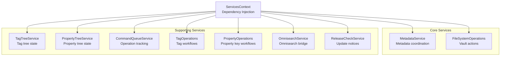
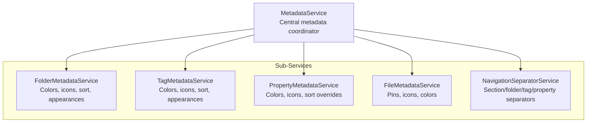
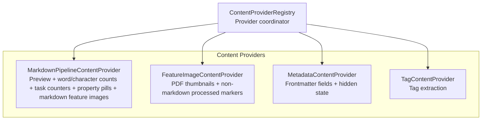

# Notebook Navigator Service Architecture

Updated: July 9, 2026

## Table of Contents

- [Overview](#overview)
- [Service Hierarchy](#service-hierarchy)
- [Core Services](#core-services)
- [Plugin-Managed Services](#plugin-managed-services)
- [Supporting Services](#supporting-services)
- [Dependency Injection](#dependency-injection)
- [Service Initialization](#service-initialization)
- [Data Flow](#data-flow)
- [Service Patterns](#service-patterns)

## Overview

The service layer hosts business logic that coordinates between the storage system and the React UI. Services handle
vault mutations, metadata updates, background processing, and integration points. React components call into services
through contexts, hooks, and the public API.

Most UI code accesses services through `ServicesContext`. The provider exposes the Obsidian `app`, the plugin instance,
a mobile flag, and the plugin-managed singletons:

- `fileSystemOps` (`FileSystemOperations`)
- `metadataService` (`MetadataService`)
- `propertyOperations` (`PropertyOperations`)
- `tagOperations` (`TagOperations`)
- `tagTreeService` (`TagTreeService`)
- `propertyTreeService` (`PropertyTreeService`)
- `commandQueue` (`CommandQueueService`)
- `omnisearchService` (`OmnisearchService`)
- `releaseCheckService` (`ReleaseCheckService`)

Convenience hooks wrap `ServicesContext` access:

- `useServices()` returns the full context
- `useFileSystemOps()` returns `fileSystemOps`
- `useMetadataService()`, `useTagOperations()`, `usePropertyOperations()`, and `useCommandQueue()` throw when the service is `null`

These instances are created during plugin startup and remain singletons for the lifetime of the plugin.
`ServicesProvider` throws if `fileSystemOps` is not initialized; other services are nullable until the plugin finishes
startup and must be guarded. `IconService` is a global singleton accessed through `getIconService()`.

### Ownership and lifetimes

- `NotebookNavigatorPlugin` owns plugin-wide singletons (services, controllers, managers) created during `onload()`.
- Each mounted `NotebookNavigatorView` owns the primary React provider tree. `ServicesContext` provides references to
  plugin singletons, while `StorageProvider` owns view-scoped storage state and background queues.
- Each mounted `NotebookNavigatorCalendarView` owns a calendar sidebar tree (`SettingsProvider` →
  `ServicesProvider` → `CalendarRightSidebar`) without `StorageProvider`, selection, or expansion providers. When no
  navigator storage runtime is active, `CalendarRightSidebar` owns a markdown-only `ContentProviderRegistry` for visible
  calendar notes.
- The main `ContentProviderRegistry` is created by `StorageProvider` inside navigator view trees (via
  `useInitializeContentProviderRegistry`) and is stopped during teardown.
- `IndexedDBStorage` is initialized once per vault via `initializeDatabase()` and is accessed through `getDBInstance()`.

`StorageContext` owns the IndexedDB sync lifecycle and the main background content pipeline through
`ContentProviderRegistry`. The registry is created when a navigator view mounts and is stopped during teardown; it is not
exposed through `ServicesContext`. The calendar sidebar fallback registry stops itself when a navigator storage runtime
is active.

See `docs/metadata-pipeline.md` (cache rebuild flow, content provider processing pipeline).

## Service Hierarchy

### ServicesContext



### Plugin-Managed Services

```mermaid
graph TB
    Plugin["NotebookNavigatorPlugin"]

    subgraph "ServicesContext exports"
        MetadataService["MetadataService<br/>Metadata coordination"]
        FileSystemOperations["FileSystemOperations<br/>Vault actions"]
        TagOperations["TagOperations<br/>Tag workflows"]
        PropertyOperations["PropertyOperations<br/>Property key workflows"]
        TagTreeService["TagTreeService<br/>Tag tree snapshot"]
        PropertyTreeService["PropertyTreeService<br/>Property tree snapshot"]
        CommandQueue["CommandQueueService<br/>Operation tracking"]
        Omnisearch["OmnisearchService<br/>Omnisearch bridge"]
        ReleaseCheck["ReleaseCheckService<br/>Update notices"]
    end

    subgraph "Other plugin services"
        RecentNotes["RecentNotesService<br/>Vault-local recents"]
        RecentData["RecentDataManager<br/>Vault-local persistence"]
        SettingsController["PluginSettingsController<br/>Settings load + sync-mode resolution"]
        PreferencesController["PluginPreferencesController<br/>UX prefs + recent data"]
        WorkspaceCoordinator["WorkspaceCoordinator<br/>Navigator + calendar leaves"]
        HomepageController["HomepageController<br/>Homepage opening"]
        FolderNoteSidebar["FolderNoteSidebarService<br/>Right-sidebar folder notes"]
        ExternalIcons["ExternalIconProviderController<br/>External icon packs"]
        DebugLogging["DebugLoggingService<br/>Startup + processing diagnostics"]
        API["NotebookNavigatorAPI<br/>Public surface"]
    end

    Plugin --> MetadataService
    Plugin --> FileSystemOperations
    Plugin --> TagOperations
    Plugin --> PropertyOperations
    Plugin --> TagTreeService
    Plugin --> PropertyTreeService
    Plugin --> CommandQueue
    Plugin --> Omnisearch
    Plugin --> ReleaseCheck

    Plugin --> RecentNotes
    Plugin --> RecentData
    Plugin --> SettingsController
    Plugin --> PreferencesController
    Plugin --> WorkspaceCoordinator
    Plugin --> HomepageController
    Plugin --> FolderNoteSidebar
    Plugin --> ExternalIcons
    Plugin --> DebugLogging
    Plugin --> API
```



### Metadata Service Structure



### Content Provider Registry Structure



The main `ContentProviderRegistry` is owned by `StorageContext`. The registry and its providers are created by
`useInitializeContentProviderRegistry` when a navigator view mounts and are stopped during teardown. The calendar
right-sidebar fallback registry registers only `MarkdownPipelineContentProvider` and is owned by `CalendarRightSidebar`.
Registries are not exposed through `ServicesContext`.

## Core Services

### MetadataService

Central coordinator for folder, tag, property, and file metadata. Delegates to specialized sub-services. Reads frontmatter-derived
metadata from IndexedDB when `useFrontmatterMetadata` is enabled. File icon/color writes and migrations use frontmatter
when `useFrontmatterMetadata` is enabled.

**Location:** `src/services/MetadataService.ts`

**Responsibilities:**

- Folder metadata: colors, background colors, icons, sort overrides, custom appearances, folder note metadata detection, and folder-note frontmatter writes.
- Tag metadata: colors, background colors, icons, sort overrides, custom appearances.
- Property metadata: key/value node colors, backgrounds, icons, list sort overrides, and child sort overrides.
- File metadata: pinned notes, icons, colors, frontmatter writes/migration helpers, iconize conversion support.
- Navigation separators: section, folder, tag, and property separator entries.
- Metadata cleanup and summary reporting based on vault state.
- Rename and delete coordination for folders, tags, and files.

**Sub-Services:**

- **FolderMetadataService** (`src/services/metadata/FolderMetadataService.ts`)
  - Validates folder existence, manages colors/backgrounds/icons, honors inheritance settings.
  - Updates metadata paths on rename and delete.
  - Cleans stale entries with diff validators.

- **TagMetadataService** (`src/services/metadata/TagMetadataService.ts`)
  - Tracks tag colors/backgrounds/icons/sort overrides.
  - Updates nested metadata paths on tag rename/delete.
  - Resolves inherited tag colors/backgrounds when enabled.
  - Uses tag tree snapshots for cleanup.

- **PropertyMetadataService** (`src/services/metadata/PropertyMetadataService.ts`)
  - Tracks property key/value colors, backgrounds, icons, list sort overrides, and child sort overrides.
  - Normalizes property node ids and supports key/value-level metadata.
  - Validates settings-backed property metadata against configured property fields.

- **FileMetadataService** (`src/services/metadata/FileMetadataService.ts`)
  - Manages pinned notes per folder/tag/property context.
  - Stores file icons and colors with frontmatter writes, settings fallback, and migration.
  - Updates metadata during file rename/delete and syncs with IndexedDB cache.

- **NavigationSeparatorService** (`src/services/metadata/NavigationSeparatorService.ts`)
  - Persists separators for navigation sections, folders, tags, and property nodes.
  - Updates separator keys on folder/tag rename and delete.
  - Cleans stale entries during metadata cleanup and exposes a versioned subscription.

**Selected API surface (examples):**

```typescript
// Folder metadata
setFolderColor(folderPath: string, color: string): Promise<void>
setFolderBackgroundColor(folderPath: string, color: string): Promise<void>
removeFolderColor(folderPath: string): Promise<void>
removeFolderBackgroundColor(folderPath: string): Promise<void>
getFolderColor(folderPath: string): string | undefined
getFolderBackgroundColor(folderPath: string): string | undefined
setFolderIcon(folderPath: string, iconId: string): Promise<void>
removeFolderIcon(folderPath: string): Promise<void>
getFolderIcon(folderPath: string): string | undefined
setFolderStyle(folderPath: string, style: { icon?: string | null; color?: string | null; backgroundColor?: string | null }): Promise<void>
setFolderStyleChangeListener(listener: ((folderPath: string) => void) | null): void
getFolderDisplayData(folderPath: string): FolderDisplayData
getFolderDisplayVersion(): number
getFolderDisplayNameVersion(): number
setFolderSortOverride(folderPath: string, sortOverride: ListSortOverrideValue): Promise<void>
removeFolderSortOverride(folderPath: string): Promise<void>
getFolderSortOverride(folderPath: string): ListSortOverrideValue | undefined
setFolderChildSortOrderOverride(folderPath: string, sortOrder: AlphaSortOrder): Promise<void>
removeFolderChildSortOrderOverride(folderPath: string): Promise<void>
getFolderChildSortOrderOverride(folderPath: string): AlphaSortOrder | undefined
handleFolderRename(oldPath: string, newPath: string): Promise<void>
handleFolderDelete(folderPath: string): Promise<void>

// Tag metadata
setTagColor(tagPath: string, color: string): Promise<void>
setTagBackgroundColor(tagPath: string, color: string): Promise<void>
removeTagColor(tagPath: string): Promise<void>
removeTagBackgroundColor(tagPath: string): Promise<void>
getTagColor(tagPath: string): string | undefined
getTagBackgroundColor(tagPath: string): string | undefined
getTagColorData(tagPath: string): TagColorData
setTagIcon(tagPath: string, iconId: string): Promise<void>
removeTagIcon(tagPath: string): Promise<void>
getTagIcon(tagPath: string): string | undefined
handleTagRename(oldPath: string, newPath: string, preserveExisting?: boolean): Promise<void>
handleTagDelete(tagPath: string): Promise<void>
setTagSortOverride(tagPath: string, sortOverride: ListSortOverrideValue): Promise<void>
removeTagSortOverride(tagPath: string): Promise<void>
getTagSortOverride(tagPath: string): ListSortOverrideValue | undefined
setTagChildSortOrderOverride(tagPath: string, sortOrder: AlphaSortOrder): Promise<void>
removeTagChildSortOrderOverride(tagPath: string): Promise<void>
getTagChildSortOrderOverride(tagPath: string): AlphaSortOrder | undefined

// Property metadata
setPropertyColor(nodeId: string, color: string): Promise<void>
setPropertyBackgroundColor(nodeId: string, color: string): Promise<void>
removePropertyColor(nodeId: string): Promise<void>
removePropertyBackgroundColor(nodeId: string): Promise<void>
getPropertyColor(nodeId: string): string | undefined
getPropertyBackgroundColor(nodeId: string): string | undefined
getPropertyColorData(nodeId: string): PropertyColorData
setPropertyIcon(nodeId: string, iconId: string): Promise<void>
removePropertyIcon(nodeId: string): Promise<void>
getPropertyIcon(nodeId: string): string | undefined
setPropertySortOverride(nodeId: string, sortOverride: ListSortOverrideValue): Promise<void>
removePropertySortOverride(nodeId: string): Promise<void>
getPropertySortOverride(nodeId: string): ListSortOverrideValue | undefined
setPropertyChildSortOrderOverride(nodeId: string, sortOrder: AlphaSortOrder): Promise<void>
removePropertyChildSortOrderOverride(nodeId: string): Promise<void>
getPropertyChildSortOrderOverride(nodeId: string): AlphaSortOrder | undefined

// Navigation separators
getNavigationSeparators(): Record<string, boolean>
hasNavigationSeparator(target: NavigationSeparatorTarget): boolean
addNavigationSeparator(target: NavigationSeparatorTarget): Promise<void>
removeNavigationSeparator(target: NavigationSeparatorTarget): Promise<void>
getNavigationSeparatorsVersion(): number
subscribeToNavigationSeparatorChanges(listener: (version: number) => void): () => void

// File metadata
togglePin(filePath: string, context: NavigatorContext): Promise<void>
pinNotes(filePaths: string[], context: NavigatorContext): Promise<number>
isFilePinned(filePath: string, context?: NavigatorContext): boolean
getPinnedNotes(context?: NavigatorContext): string[]
setFileIcon(filePath: string, iconId: string): Promise<void>
removeFileIcon(filePath: string): Promise<void>
getFileIcon(filePath: string): string | undefined
setFileColor(filePath: string, color: string): Promise<void>
removeFileColor(filePath: string): Promise<void>
getFileColor(filePath: string): string | undefined
setFileBackgroundColor(filePath: string, color: string): Promise<void>
removeFileBackgroundColor(filePath: string): Promise<void>
getFileBackgroundColor(filePath: string): string | undefined
migrateFileMetadataToFrontmatter(): Promise<FileMetadataMigrationResult>
handleFileDelete(filePath: string): Promise<void>
handleFileRename(oldPath: string, newPath: string): Promise<void>

// Cleanup utilities
cleanupAllMetadata(targetSettings?: NotebookNavigatorSettings): Promise<boolean>
cleanupTagMetadata(targetSettings?: NotebookNavigatorSettings): Promise<boolean>
runUnifiedCleanup(validators: CleanupValidators, targetSettings?: NotebookNavigatorSettings): Promise<boolean>
getCleanupSummary(): Promise<MetadataCleanupSummary>
MetadataService.prepareCleanupValidators(app: App, tagTree?: Map<string, TagTreeNode>): CleanupValidators
```

### FileSystemOperations

Handles all vault mutations triggered from the navigator, including confirmation modals, selection updates, and command
queue integration.

**Location:** `src/services/FileSystemService.ts`

**Responsibilities:**

- File and folder creation, rename, deletion, duplication.
- Folder note conversion with conflict handling.
- Tag/property-driven note creation and property assignment.
- Manual sort placement for newly created notes in folder, tag, and property contexts.
- Batch file moves with modal workflows and selection updates.
- Canvas/base drawing creation and reveal helpers.
- Command queue tracking for deletes, moves, and folder renames.
- System actions such as reveal in explorer, open in default app, and version history.

**Key Methods:**

```typescript
createNewFolder(parent: TFolder, onSuccess?: (path: string) => void): Promise<void>
createNewFile(parent: TFolder, openInNewTab?: boolean, manualSortContext?: ManualSortNewFilePlacementContext | null): Promise<TFile | null>
createNewFileForTag(
  tagPath: string,
  sourcePath?: string,
  openInNewTab?: boolean,
  manualSortContext?: ManualSortNewFilePlacementContext | null
): Promise<TFile | null>
createNewFileForProperty(
  propertyNodeId: string,
  sourcePath?: string,
  openInNewTab?: boolean,
  manualSortContext?: ManualSortNewFilePlacementContext | null
): Promise<TFile | null>
renameFolderToName(folder: TFolder, newName: string, settings?: NotebookNavigatorSettings): Promise<boolean>
renameFolderDisplayName(folder: TFolder, value: string, settings?: NotebookNavigatorSettings): Promise<boolean>
renameFile(file: TFile): Promise<void>
renameFileDisplayName(file: TFile, rawInput: string): Promise<boolean>
renameFileToName(file: TFile, rawInput: string): Promise<boolean>
deleteFolder(folder: TFolder, confirmBeforeDelete: boolean, onSuccess?: () => void): Promise<void>
deleteFile(file: TFile, confirmBeforeDelete: boolean, onSuccess?: () => void, preDeleteAction?: () => Promise<void>): Promise<void>
deleteSelectedFile(
  file: TFile,
  settings: NotebookNavigatorSettings,
  selectionContext: SelectionContext,
  selectionDispatch: SelectionDispatch,
  confirmBeforeDelete: boolean
): Promise<void>
duplicateNote(file: TFile): Promise<void>
duplicateFolder(folder: TFolder): Promise<void>
isDescendant(parent: TAbstractFile, child: TAbstractFile): boolean

moveFilesToFolder(options: MoveFilesOptions): Promise<MoveFilesResult>
moveFilesWithModal(
  files: TFile[],
  selectionContext?: {
    selectedFile: TFile | null;
    dispatch: SelectionDispatch;
    allFiles: TFile[];
  }
): Promise<void>
moveFolderWithModal(
  folder: TFolder
): Promise<
  | { status: 'success'; data: MoveFolderResult }
  | { status: 'cancelled' }
  | { status: 'error'; error: unknown }
>
moveFolderToTarget(folder: TFolder, targetFolder: TFolder): Promise<MoveFolderResult>

convertFileToFolderNote(file: TFile, settings: NotebookNavigatorSettings): Promise<void>
setFileAsFolderNote(file: TFile, settings: NotebookNavigatorSettings): Promise<void>

deleteMultipleFiles(
  files: TFile[],
  confirmBeforeDelete: boolean,
  preDeleteAction?: () => void | Promise<void>
): Promise<void>
trashFilesWithOpenLeafCleanup(files: readonly TFile[]): Promise<FileTrashResult>
deleteFilesWithSmartSelection(
  selectedFiles: Set<string>,
  allFiles: readonly TFile[],
  selectionDispatch: SelectionDispatch,
  confirmBeforeDelete: boolean
): Promise<void>

createCanvas(parent: TFolder): Promise<TFile | null>
createBase(parent: TFolder): Promise<TFile | null>
createNewDrawing(parent: TFolder, type?: 'excalidraw' | 'tldraw'): Promise<TFile | null>
applyPropertyNodeToFiles(propertyNodeId: string, files: readonly TFile[]): Promise<ApplyPropertyNodeResult>
setManualSortNewFileContextProvider(provider: (() => ManualSortNewFilePlacementContext | null) | null): () => void
getManualSortNewFileContextForTarget(
  targetType: ManualSortNewFilePlacementContext['targetType'],
  targetKey: string,
  options?: { waitForSelectionUpdate?: boolean }
): Promise<ManualSortNewFilePlacementContext | null>

openVersionHistory(file: TFile): Promise<void>
getRevealInSystemExplorerText(): string
revealInSystemExplorer(file: TFile | TFolder): Promise<void>
openInDefaultApp(file: TFile | TFolder): Promise<void>
```

### ContentProviderRegistry

Coordinates background content providers that populate IndexedDB mirrors used by the UI. The main registry is owned by
`StorageContext`; the calendar right-sidebar fallback owns a markdown-only registry while no navigator storage runtime is
active.

**Location:** `src/services/content/ContentProviderRegistry.ts`

`StorageContext` creates the main registry in `useInitializeContentProviderRegistry`
(`src/context/storage/useInitializeContentProviderRegistry.ts`). That hook wires shared helpers used across providers:

- `ContentReadCache` (shared `vault.cachedRead()` cache)
- `FeatureImageThumbnailRuntime` (shared thumbnail/external-request runtime for feature images)

`CalendarRightSidebar` (`src/components/CalendarRightSidebar.tsx`) creates a fallback registry with only
`MarkdownPipelineContentProvider` for visible calendar markdown files when `StorageProvider` is not mounted.

**Responsibilities:**

- Provider registration and lookup.
- Settings change coordination, including clearing content and notifying providers.
- Batching queues across providers with optional include/exclude filters.
- Stopping provider processing during teardown.

**Registry Methods:**

```typescript
registerProvider(provider: IContentProvider): void
getProvider(type: ContentProviderType): IContentProvider | undefined
getAllProviders(): IContentProvider[]
getAllRelevantSettings(): (keyof NotebookNavigatorSettings)[]
handleSettingsChange(oldSettings: NotebookNavigatorSettings, newSettings: NotebookNavigatorSettings): Promise<ContentProviderType[]>
queueFilesForAllProviders(
  files: TFile[],
  settings: NotebookNavigatorSettings,
  options?: { include?: ContentProviderType[]; exclude?: ContentProviderType[] }
): void
stopAllProcessing(): void
```

**Content Providers:**

- **MarkdownPipelineContentProvider** (`src/services/content/MarkdownPipelineContentProvider.ts`)
  - Generates markdown-derived content in a single pass (preview text, word/character counts, task counters, property pills, markdown feature images).
  - Extends `FeatureImageContentProvider`; uses its thumbnail helpers with local files and external references.
  - Uses Obsidian's metadata cache for frontmatter and frontmatter position offsets.

- **FeatureImageContentProvider** (`src/services/content/FeatureImageContentProvider.ts`)
  - Generates PDF thumbnails and records processed markers for other non-markdown files.
  - Provides thumbnail helpers used by `MarkdownPipelineContentProvider` (local images, external URLs, YouTube).

- **MetadataContentProvider** (`src/services/content/MetadataContentProvider.ts`)
  - Extracts configured frontmatter metadata fields and hidden state based on active vault profile hidden frontmatter properties.

- **TagContentProvider** (`src/services/content/TagContentProvider.ts`)
  - Extracts tags from Obsidian's metadata cache (`getAllTags(metadata)`).
  - Deduplicates case variants and stores values without the `#` prefix.

## Plugin-Managed Services

These services live on the plugin instance and are surfaced to React code through specialized contexts, helper methods,
or module-level helpers.

### RecentNotesService

**Location:** `src/services/RecentNotesService.ts`

**Responsibilities:**

- Maintains the recent notes list stored in vault-local storage.
- Deduplicates entries, enforces configurable limits, and preserves ordering.
- Provides helpers for open, rename, and delete events.

**Key Methods:**

```typescript
recordFileOpen(file: TFile): boolean
renameEntry(oldPath: string, newPath: string): boolean
removeEntry(path: string): boolean
```

### RecentDataManager

**Location:** `src/services/recent/RecentDataManager.ts`

**Responsibilities:**

- Wraps `RecentStorageService` lifecycle for vault-local storage of recent notes and icons.
- Hydrates data during plugin startup and notifies listeners on change.
- Applies limits and handles flushing pending persisting tasks.

**Key Methods:**

```typescript
initialize(activeVaultProfileId: string): void
dispose(): void
getRecentNotes(): string[]
setRecentNotes(recentNotes: string[]): void
applyRecentNotesLimit(): void
getRecentIcons(): Record<string, string[]>
setRecentIcons(recentIcons: Record<string, string[]>): void
flushPendingPersists(): void
```

### PluginSettingsController and PluginPreferencesController

**Location:** `src/services/settings/PluginSettingsController.ts`, `src/services/settings/PluginPreferencesController.ts`

**Responsibilities:**

- `PluginSettingsController` loads `data.json`, runs synced/local preference migrations, owns sync-mode resolution through the
  internal `syncModeRegistry`, and persists normalized settings.
- `PluginPreferencesController` manages vault-local UX preferences, dual-pane state mirrors, and `RecentDataManager`
  lifecycle/listeners.

`NotebookNavigatorPlugin` owns both controllers as long-lived instances. The sync-mode registry still lives in
`src/services/settings/syncModeRegistry.ts`, but it is created and cached inside `PluginSettingsController`, not on the
plugin instance directly.

### ExternalIconProviderController

**Location:** `src/services/icons/external/ExternalIconProviderController.ts`

Lazily created when external icon providers are enabled or managed. If no external providers are enabled, startup only
initializes `IconService` and registers `VaultIconProvider`.

**Responsibilities:**

- Manages install/update/removal flow for external icon packs.
- Downloads assets, stores them in `IconAssetDatabase`, and registers providers with `IconService`.
- Syncs provider enablement with plugin settings and bundled manifests.

**Key Methods:**

```typescript
initialize(): Promise<void>
dispose(): void
installProvider(id: ExternalIconProviderId, options?: InstallOptions): Promise<void>
removeProvider(id: ExternalIconProviderId, options?: RemoveOptions): Promise<void>
syncWithSettings(): Promise<void>
isProviderInstalled(id: ExternalIconProviderId): boolean
isProviderDownloading(id: ExternalIconProviderId): boolean
getProviderVersion(id: ExternalIconProviderId): string | null
```

### WorkspaceCoordinator

**Location:** `src/services/workspace/WorkspaceCoordinator.ts`

**Responsibilities:**

- Ensures navigator leaves exist and are revealed.
- Ensures the calendar view leaf is attached to the right sidebar when `calendarPlacement` is `right-sidebar`.
- Coordinates manual and contextual reveal actions for files across all navigator instances.

**Key Methods:**

```typescript
activateNavigatorView(): Promise<WorkspaceLeaf | null>
getNavigatorLeaves(): WorkspaceLeaf[]
detachCalendarViewLeaves(): void
ensureCalendarViewInRightSidebar(options?: {
  reveal?: boolean
  activate?: boolean
  shouldContinue?: () => boolean
}): Promise<WorkspaceLeaf | null>
revealFileInActualFolder(file: TFile, options?: RevealFileOptions): void
revealFileInNearestFolder(file: TFile, options?: RevealFileOptions): void
```

`revealFileInActualFolder(...)` is strict reveal behavior. Hidden files are not revealable while hidden items are off. In that case the view keeps its current folder, tag, or property context and may update selected file as fallback.

### FolderNoteSidebarService

**Location:** `src/services/workspace/FolderNoteSidebarService.ts`

**Responsibilities:**

- Maintains the right-sidebar companion leaf used by folder notes when `folderNoteOpenLocation` is `right-sidebar`.
- Follows the selected folder when `showNearestFolderNoteInSidebar` is enabled.
- Reuses restored companion leaves, prunes duplicate placeholder/folder-note leaves, and preserves the previous active leaf.
- Suppresses recent-note tracking for background folder-note sidebar opens.

**Key Methods:**

```typescript
start(): void
dispose(): void
handleWorkspaceReady(): void | Promise<void>
isSuppressingSidebarOpen(path: string): boolean
openFolderNote(folderNote: TFile): Promise<void>
syncToSelectedFolder(folder: TFolder | null): Promise<void>
```

### HomepageController

**Location:** `src/services/workspace/HomepageController.ts`

**Responsibilities:**

- Resolves the configured homepage target and opens it at startup or via command.
- Works with `WorkspaceCoordinator` and `CommandQueueService` to open files and reveal them in the navigator.
- Handles deferred triggers while the workspace loads.

**Key Methods:**

```typescript
resolveHomepageFile(): TFile | null
canOpenHomepage(): boolean
handleWorkspaceReady(options: { shouldActivateOnStartup: boolean }): Promise<void>
open(trigger: 'startup' | 'command'): Promise<boolean>
```

### NotebookNavigatorAPI

**Location:** `src/api/NotebookNavigatorAPI.ts`

Provides the typed public API surface for external integrations and internal cross-context events.

- Sub-APIs/helpers: `navigation`, `metadata`, `selection`, `menus`, `propertyNodes`, and `tagCollections`
  (`src/api/modules/*`, `src/utils/virtualTagCollections.ts`)
- Event bus: `on(...)`, `once(...)`, `off(...)` (`src/api/NotebookNavigatorAPI.ts`)
- Storage readiness: `isStorageReady()` and `whenReady()` are public; internal readiness updates use the internal API bridge

## Supporting Services

### TagTreeService

Bridge between React storage state and non-React consumers that need tag data.

**Location:** `src/services/TagTreeService.ts`

**Responsibilities:**

- Stores latest tag tree snapshot and tagged/untagged counts.
- Provides lookup helpers used by services outside React.

**Key Methods:**

```typescript
updateTagTree(tree: Map<string, TagTreeNode>, tagged: number, untagged: number): void
getTagTree(): Map<string, TagTreeNode>
hasNodes(): boolean
addTreeUpdateListener(listener: () => void): () => void
getFlattenedTagNodes(): readonly TagTreeNode[]
getUntaggedCount(): number
getTaggedCount(): number
findTagNode(tagPath: string): TagTreeNode | null
resolveSelectionTagPath(tagPath: string): string | null
getAllTagPaths(): readonly string[]
collectDescendantTagPaths(tagPath: string): Set<string>
collectTagFilePaths(tagPath: string): string[]
```

### PropertyTreeService

Bridge between React storage state and non-React consumers that need property node data.

**Location:** `src/services/PropertyTreeService.ts`

**Responsibilities:**

- Stores latest property tree snapshot keyed by normalized property key.
- Provides property node lookup and selection id resolution.
- Collects descendant node ids and file paths for property key/value nodes.
- Publishes tree update events to consumers outside React.

**Key Methods:**

```typescript
updatePropertyTree(tree: Map<string, PropertyTreeNode>): void
getPropertyTree(): Map<string, PropertyTreeNode>
hasNodes(): boolean
addTreeUpdateListener(listener: () => void): () => void
findNode(nodeId: string): PropertyTreeNode | null
getKeyNode(normalizedKey: string): PropertyTreeNode | null
resolveSelectionNodeId(selectionNodeId: PropertySelectionNodeId): PropertySelectionNodeId
collectDescendantNodeIds(nodeId: string): Set<string>
collectFilePaths(nodeId: string, includeDescendants: boolean): Set<string>
collectFilesForKeys(normalizedKeys: Iterable<string>): Set<string>
```

### CommandQueueService

Tracks in-flight operations so React code can batch updates and adjust behavior during complex flows.

**Location:** `src/services/CommandQueueService.ts`

**Responsibilities:**

- Records move/delete operations, folder renames, folder note opens, version history opens, new context opens,
  background file opens, active file opens, and homepage loads.
- Provides `onOperationChange` subscription for UI hooks.
- Serializes open-active-file requests and tracks active operation state.

**Operation Types:**

```typescript
enum OperationType {
  MOVE_FILE = 'move-file',
  RENAME_FOLDER = 'rename-folder',
  DELETE_FILES = 'delete-files',
  OPEN_FOLDER_NOTE = 'open-folder-note',
  OPEN_VERSION_HISTORY = 'open-version-history',
  OPEN_IN_NEW_CONTEXT = 'open-in-new-context',
  OPEN_BACKGROUND_FILE = 'open-background-file',
  OPEN_ACTIVE_FILE = 'open-active-file',
  OPEN_HOMEPAGE = 'open-homepage'
}
```

**Key Methods:**

```typescript
onOperationChange(listener: (type: OperationType, active: boolean) => void): () => void
hasActiveOperation(type: OperationType): boolean
getActiveOperations(): Operation[]
clearAllOperations(): void

isMovingFile(): boolean
isRenamingFolder(): boolean
isChangingFilePaths(): boolean
isDeletingFiles(): boolean
isOpeningFolderNote(): boolean
isOpeningHomepage(): boolean
isOpeningVersionHistory(): boolean
isOpeningInNewContext(): boolean
isBackgroundFileOpenInProgress(): boolean
consumeBackgroundFileOpen(filePath: string, leaf: WorkspaceLeaf | null): boolean
consumeBackgroundActiveLeafChange(leaf: WorkspaceLeaf | null): boolean

executeMoveFiles(
  files: TFile[],
  targetFolder: TFolder,
  performMove: () => Promise<MoveFilesCommandData>
): Promise<CommandResult<MoveFilesCommandData>>
executeRenameFolder(folderPath: string, performRename: () => Promise<void>): Promise<CommandResult<void>>
executeDeleteFiles(files: TFile[], performDelete: () => Promise<void>): Promise<CommandResult>
executeOpenFolderNote(folderPath: string, openFile: () => Promise<void>): Promise<CommandResult>
executeOpenVersionHistory(file: TFile, openHistory: () => Promise<void>): Promise<CommandResult>
executeOpenInNewContext(file: TFile, context: PaneType, openFile: () => Promise<void>): Promise<CommandResult>
executeBackgroundFileOpen(
  file: TFile,
  openFile: (targetLeaf: WorkspaceLeaf | null) => Promise<void>,
  options?: { getLeaf?: () => WorkspaceLeaf | null }
): Promise<CommandResult>
executeOpenActiveFile(
  file: TFile,
  openFile: (targetLeaf: WorkspaceLeaf | null) => Promise<void>,
  options?: { active?: boolean; getLeaf?: () => WorkspaceLeaf | null }
): Promise<CommandResult<{ skipped: boolean }>>
executeHomepageOpen(file: TFile, openFile: () => Promise<void>): Promise<CommandResult>
```

### TagOperations

Facade for tag operations across the vault.

**Location:** `src/services/TagOperations.ts`

**Responsibilities:**

- Adds tags while preventing duplicates and ancestor conflicts.
- Removes single tags or clears all tags from files.
- Renames and deletes tags using modal workflows and file mutations.
- Updates tag metadata and shortcuts after tag rename/delete operations.
- Emits tag rename/delete events to registered listeners.

**Key Methods:**

```typescript
addTagRenameListener(listener: (payload: TagRenameEventPayload) => void): () => void
addTagDeleteListener(listener: (payload: TagDeleteEventPayload) => void): () => void
addTagToFiles(tag: string, files: TFile[]): Promise<{ added: number; skipped: number }>
removeTagFromFiles(tag: string, files: TFile[]): Promise<number>
clearAllTagsFromFiles(files: TFile[]): Promise<number>
getTagsFromFiles(files: TFile[]): string[]
promptRenameTag(tagPath: string): Promise<void>
renameTag(tagPath: string, newTagPath: string): Promise<boolean>
promoteTagToRoot(sourceTagPath: string): Promise<void>
renameTagByDrag(sourceTagPath: string, targetTagPath: string): Promise<void>
promptDeleteTag(tagPath: string): Promise<void>
```

### PropertyOperations

Facade for property key rename/delete workflows across the vault.

**Location:** `src/services/PropertyOperations.ts`

**Responsibilities:**

- Renames and deletes property keys through modal workflows and batched frontmatter mutations.
- Updates settings-backed property metadata records and active-profile property field lists after successful changes.
- Emits property rename/delete events to listeners used by the React layer and other services.

**Key Methods:**

```typescript
addPropertyKeyRenameListener(listener: (payload: PropertyKeyRenameEventPayload) => void): () => void
addPropertyKeyDeleteListener(listener: (payload: PropertyKeyDeleteEventPayload) => void): () => void
promptRenamePropertyKey(normalizedKey: string): Promise<void>
renamePropertyKey(normalizedKey: string, newKey: string): Promise<boolean>
promptDeletePropertyKey(normalizedKey: string): Promise<void>
```

### OmnisearchService

Optional integration with the community Omnisearch plugin.

**Location:** `src/services/OmnisearchService.ts`

**Responsibilities:**

- Detects the Omnisearch API through plugin manager or global scope.
- Executes full-text searches and normalizes result data.
- Registers indexing callbacks when Omnisearch is available.

**Key Methods:**

```typescript
isAvailable(): boolean
search(query: string, options?: { pathScope?: string }): Promise<OmnisearchHit[]>
registerOnIndexed(callback: () => void): void
unregisterOnIndexed(callback: () => void): void
```

### IconService

Global singleton that coordinates icon providers and rendering.

**Location:** `src/services/icons/IconService.ts`

**Responsibilities:**

- Built-in providers (`LucideIconProvider`, `EmojiIconProvider`) are registered during `getIconService()` initialization.
- Manages provider registry, icon id parsing/formatting, rendering, validation, and search.
- `ExternalIconProviderController` registers downloadable providers with `IconService`.

**Icon Providers:**

- Built-in: `LucideIconProvider`, `EmojiIconProvider`
- Downloadable: `BootstrapIconProvider`, `FontAwesomeIconProvider`, `MaterialIconProvider`, `PhosphorIconProvider`,
  `RpgAwesomeIconProvider`, `SimpleIconsProvider`

**Key Methods:**

```typescript
registerProvider(provider: IconProvider): void
unregisterProvider(providerId: string): void
getProvider(providerId: string): IconProvider | undefined
getAllProviders(): IconProvider[]
parseIconId(iconId: string): ParsedIconId
formatIconId(provider: string, identifier: string): string
renderIcon(container: HTMLElement, iconId: string, size?: number): void
isValidIcon(iconId: string): boolean
search(query: string, providerId?: string): IconDefinition[]
getAllIcons(providerId?: string): IconDefinition[]
getVersion(): number
subscribe(listener: () => void): () => void
```

### ReleaseCheckService

**Location:** `src/services/ReleaseCheckService.ts`

**Responsibilities:**

- Polls GitHub releases and compares versions with the installed plugin.
- Stores timestamps and latest announced releases in settings.
- Provides pending notices consumed by the React UI.

**Key Methods:**

```typescript
checkForUpdates(force?: boolean): Promise<ReleaseUpdateNotice | null>
getPendingNotice(): ReleaseUpdateNotice | null
clearPendingNotice(): void
```

### DebugLoggingService

**Location:** `src/services/diagnostics/DebugLoggingService.ts`

**Responsibilities:**

- Tracks startup timing, storage readiness, and first user-visible UI timing when debug logging is enabled.
- Records content-provider batch summaries and explicit diagnostic reports.
- Writes debounced `nn-debug-*.md` files in the vault root and exposes module helpers used by startup/storage/content code.

**Key Methods and Helpers:**

```typescript
// Instance methods
initialize(): void
dispose(): void
isEnabled(): boolean
isActive(): boolean
getLogPath(): string
setEnabled(enabled: boolean): void
recordStartupEvent(event: string, details?: Record<string, unknown>): void
recordStorageReady(details: Record<string, unknown>): void
recordUserVisible(details?: Record<string, unknown>): void
finishStartupReport(reason: string, details?: Record<string, unknown>): void
logReport(title: string, details: Record<string, unknown>): void
recordContentProviderBatch(summary: ContentProviderBatchSummary): void
flush(): Promise<void>

// Module helpers
recordStartupDiagnostic(event: string, details?: Record<string, unknown>): void
finishStartupDiagnostics(details: Record<string, unknown>): void
recordStartupUserVisible(details?: Record<string, unknown>): void
recordDebugReport(title: string, details: Record<string, unknown>): void
recordContentProviderBatch(summary: ContentProviderBatchSummary): void
```

## Dependency Injection

Many storage and metadata helpers depend on small provider interfaces (`ISettingsProvider`, `ITagTreeProvider`,
`IPropertyTreeProvider`), while plugin/workspace controllers still depend on `NotebookNavigatorPlugin` or concrete
services.

### ISettingsProvider

**Location:** `src/interfaces/ISettingsProvider.ts`

```typescript
interface ISettingsProvider {
  readonly settings: NotebookNavigatorSettings;
  saveSettingsAndUpdate(): Promise<void>;
  notifySettingsUpdate(): void;
  getRecentNotes(): string[];
  setRecentNotes(recentNotes: string[]): void;
  getRecentIcons(): Record<string, string[]>;
  setRecentIcons(recentIcons: Record<string, string[]>): void;
  getRecentColors(): string[];
  setRecentColors(recentColors: string[]): void;
}
```

### ITagTreeProvider

**Location:** `src/interfaces/ITagTreeProvider.ts`

```typescript
interface ITagTreeProvider {
  addTreeUpdateListener(listener: () => void): () => void;
  hasNodes(): boolean;
  findTagNode(tagPath: string): TagTreeNode | null;
  resolveSelectionTagPath(tagPath: string): string | null;
  getAllTagPaths(): readonly string[];
  collectDescendantTagPaths(tagPath: string): Set<string>;
  collectTagFilePaths(tagPath: string): string[];
}
```

### IPropertyTreeProvider

**Location:** `src/interfaces/IPropertyTreeProvider.ts`

```typescript
interface IPropertyTreeProvider {
  addTreeUpdateListener(listener: () => void): () => void;
  hasNodes(): boolean;
  findNode(nodeId: string): PropertyTreeNode | null;
  getKeyNode(normalizedKey: string): PropertyTreeNode | null;
  resolveSelectionNodeId(selectionNodeId: PropertySelectionNodeId): PropertySelectionNodeId;
  collectDescendantNodeIds(nodeId: string): Set<string>;
  collectFilePaths(nodeId: string, includeDescendants: boolean): Set<string>;
  collectFilesForKeys(normalizedKeys: Iterable<string>): Set<string>;
}
```

### IContentProvider

**Location:** `src/interfaces/IContentProvider.ts`

```typescript
interface IContentProvider {
  getContentType(): ContentProviderType;
  getRelevantSettings(): (keyof NotebookNavigatorSettings)[];
  shouldRegenerate(oldSettings: NotebookNavigatorSettings, newSettings: NotebookNavigatorSettings): boolean;
  clearContent(context?: ContentProviderClearContext): Promise<void>;
  queueFiles(files: TFile[]): void;
  startProcessing(settings: NotebookNavigatorSettings): void;
  stopProcessing(): void;
  waitForIdle(): Promise<void>;
  onSettingsChanged(settings: NotebookNavigatorSettings): void;
}
```

## Service Initialization

Services are instantiated during plugin startup (see `docs/startup-process.md`, phase 1). The current initialization
sequence in `src/main.ts` is:

```typescript
// Database and settings load happen before this block
this.preferencesController.initializeRecentDataManager();
this.recentNotesService = new RecentNotesService(this);

// Initialize workspace and homepage coordination
this.workspaceCoordinator = new WorkspaceCoordinator(this);
this.homepageController = new HomepageController(this, this.workspaceCoordinator);

// Initialize services
this.tagTreeService = new TagTreeService();
this.propertyTreeService = new PropertyTreeService();
this.metadataService = new MetadataService(
  this.app,
  this,
  () => this.tagTreeService,
  () => this.propertyTreeService
);
this.tagOperations = new TagOperations(
  this.app,
  () => this.settings,
  () => this.tagTreeService,
  () => this.metadataService
);
this.propertyOperations = new PropertyOperations(
  this.app,
  () => this.settings,
  () => this.saveSettingsAndUpdate(),
  () => this.propertyTreeService
);
this.commandQueue = new CommandQueueService();
this.folderNoteSidebarService = new FolderNoteSidebarService(this);
this.folderNoteSidebarService.start();
this.fileSystemOps = new FileSystemOperations(
  this.app,
  () => this.tagTreeService,
  () => this.propertyTreeService,
  () => this.commandQueue,
  () => this.metadataService,
  (): VisibilityPreferences => ({
    includeDescendantNotes: this.preferencesController.getUXPreferences().includeDescendantNotes,
    showHiddenItems: this.preferencesController.getUXPreferences().showHiddenItems
  }),
  this
);
this.omnisearchService = new OmnisearchService(this.app);
this.api = new NotebookNavigatorAPI(this, this.app);
this.metadataService.setFolderStyleChangeListener(folderPath => {
  if (this.isUnloading || !this.api) {
    return;
  }

  this.api[INTERNAL_NOTEBOOK_NAVIGATOR_API].metadata.emitFolderChangedForPath(folderPath);
});
this.releaseCheckService = new ReleaseCheckService(this);
recordStartupDiagnostic('services.initialized');

const iconService = getIconService();
iconService.registerProvider(new VaultIconProvider(this.app));
if (this.hasEnabledExternalIconProviders()) {
  this.syncExternalIconController();
}

this.registerSettingsUpdateListener('external-icon-controller', () => {
  if (this.externalIconController || this.hasEnabledExternalIconProviders()) {
    this.syncExternalIconController();
  }
});
```

View registration, `registerNavigatorCommands(this)`, settings tab setup, and workspace events are registered after this
block. `registerNavigatorCommands` registers command metadata at startup and lazy-loads
`navigatorCommandHandlers.ts` when a command is checked or run.

React mounts the navigator with dependency injection:

```tsx
<SettingsProvider plugin={plugin}>
  <UXPreferencesProvider plugin={plugin}>
    <RecentDataProvider plugin={plugin}>
      <ServicesProvider plugin={plugin}>
        <ShortcutsProvider>
          <StorageProvider app={plugin.app} api={plugin.api}>
            <ExpansionProvider>
              <SelectionProvider /* app/api/file rename wiring */>
                <UIStateProvider isMobile={isMobile}>
                  <NotebookNavigatorContainer />
                </UIStateProvider>
              </SelectionProvider>
            </ExpansionProvider>
          </StorageProvider>
        </ShortcutsProvider>
      </ServicesProvider>
    </RecentDataProvider>
  </UXPreferencesProvider>
</SettingsProvider>
```

`StorageProvider` creates the main `ContentProviderRegistry` during mount and registers all providers. View-scoped
contexts (`ExpansionProvider`, `SelectionProvider`, `UIStateProvider`) own React state and are not service singletons.
Processing starts when `StorageContext` queues files through `ContentProviderRegistry.queueFilesForAllProviders(...)`
(which calls `startProcessing()` for each provider). The right-sidebar calendar creates its own markdown-only registry
only while no navigator `StorageProvider` is mounted.

## Data Flow

### Content Generation Flow

1. **File Detection**: `StorageContext` picks files needing processing and calls
   `ContentProviderRegistry.queueFilesForAllProviders(...)` (optionally with include/exclude filters). Providers skip
   files without enabled features and dedupe the queue.
2. **Queue Management**: `BaseContentProvider` batches up to 100 files and processes them with a parallel limit of 10,
   with debounce timers, abort signals, and retry scheduling.
3. **Processing**: Providers read vault data and produce updates:
   - Tags and metadata via `app.metadataCache.getFileCache()` (retries when cache data is missing)
   - Preview text and word/character counts via `ContentReadCache` / `app.vault.cachedRead()` (skips oversized markdown reads via `LIMITS.markdown.maxReadBytes`)
   - Feature images via frontmatter properties, markdown body references, and attachment thumbnails (local + optional external URLs)
   - Metadata via `extractMetadataFromCache` and hidden-state checks against active vault profile hidden frontmatter properties
4. **Database Updates**: Providers persist updates via `IndexedDBStorage.batchUpdateFileContentAndProviderProcessedMtimes(...)`
   and clear content via `batchClearAllFileContent` / `batchClearFeatureImageContent`.
5. **Memory Sync**: `MemoryFileCache` mirrors IndexedDB updates for synchronous access.
6. **UI Updates**: `StorageContext` listens for database events, rebuilds tag/property trees, and updates React contexts.

### Metadata Cleanup Flow

Triggered manually from **Settings → Notebook Navigator → Advanced → Clean up metadata**.

1. **Preview**: settings UI calls `NotebookNavigatorPlugin.getMetadataCleanupSummary()` which runs
   `MetadataService.getCleanupSummary()` against a cloned settings object.
2. **Cleanup Execution**: settings UI calls `NotebookNavigatorPlugin.runMetadataCleanup()` which runs
   `MetadataService.cleanupAllMetadata()` (folder/tag/property/file/pinned note/separator cleanup).
3. **Persistence**: `NotebookNavigatorPlugin.runMetadataCleanup()` calls `saveSettingsAndUpdate()` when changes are detected.
4. **Feedback**: settings UI can re-run `getMetadataCleanupSummary()` after cleanup to confirm counts.

### File Operation Flow

1. User initiates an operation (create, rename, move, delete, duplicate).
2. `FileSystemOperations` gathers input through modals when required.
3. `CommandQueueService` wraps operations that coordinate workspace state (moves, folder renames, deletes, folder note
   opens, version history opens, new-context opens, background file opens, active file opens, homepage opens).
4. Vault mutations execute through `app.fileManager` (rename/move/trash/frontmatter) and `app.vault` (creates/reads).
5. Selection state updates via helpers from `selectionUtils`.
6. `StorageContext` observes vault events, records changes into IndexedDB, and rebuilds tag and property trees.
7. React contexts broadcast changes to the UI.

### Settings Update Flow

1. Settings UI updates values and persists via `saveSettingsAndUpdate()` (synced settings) or local preference helpers.
2. `NotebookNavigatorPlugin` notifies settings listeners (`registerSettingsUpdateListener`) and open React views.
3. `StorageContext` receives new settings and calls `ContentProviderRegistry.handleSettingsChange(old, new)` to stop
   providers, wait for idle batches, clear content when required, and re-queue work.
4. Controllers that mirror settings state (for example the lazily-created `ExternalIconProviderController`) resync based
   on updated settings.

### External Icon Pack Flow

1. `NotebookNavigatorPlugin` initializes `IconService` via `getIconService()` and registers `VaultIconProvider`.
2. `syncExternalIconController()` lazily creates `ExternalIconProviderController` when external icon providers are
   enabled or managed.
3. `ExternalIconProviderController.initialize()` loads persisted provider state and prepares the icon asset database.
4. `ExternalIconProviderController.syncWithSettings()` installs/removes providers based on settings and updates enablement.
5. `IconService` publishes version changes; React code can subscribe via `useIconServiceVersion()`.

### Workspace and Vault Event Flow

1. `registerWorkspaceEvents` wires Obsidian events (context menus, file-open, vault rename/delete).
2. File opens update recent notes via `RecentNotesService.recordFileOpen`.
3. Vault renames/deletes update metadata (`MetadataService.handle*`), recent note paths, hidden folder exact-match
   settings, and selection context file path tracking.
4. Active-file auto-reveal after a rename skips moves and folder renames initiated by the navigator
   (`CommandQueueService.isChangingFilePaths()`).

## Service Patterns

- **Singleton**: `IconService` and plugin-managed services are singleton instances; each mounted `StorageProvider` owns the main `ContentProviderRegistry`.
- **Provider**: `ContentProviderRegistry` and `IconService` manage lists of registered providers.
- **Delegation**: `MetadataService` delegates specialized work to folder/tag/property/file/separator sub-services.
- **Bridge**: `TagTreeService` and `PropertyTreeService` bridge StorageContext data to non-React consumers.
- **Observer**: `CommandQueueService`, `IconService`, recent data listeners, and `subscribeToNavigationSeparatorChanges()` publish state changes to the UI.
- **Facade**: `TagOperations` and `PropertyOperations` wrap vault-wide rename/delete workflows.
- **Controller**: `WorkspaceCoordinator`, `HomepageController`, `FolderNoteSidebarService`, and `ExternalIconProviderController` coordinate multi-step plugin flows.
